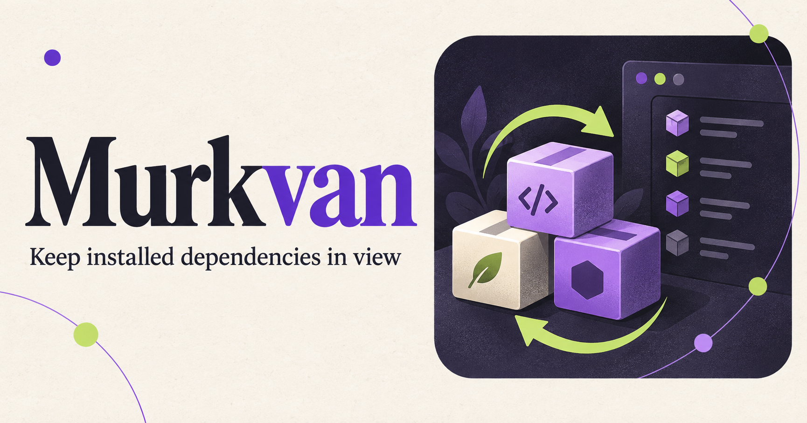

<div align="center">
  
  

  <h1>Murkvan</h1>
  <p><strong>Keep installed npm packages in step with your workspace.</strong></p>
  <p>
    
    
    
  </p>
  <p><a href="#install">Install</a> · <a href="#how-it-works">How it works</a> · <a href="#commands">Commands</a> · <a href="https://github.com/pagyew/vscode-murkvan/releases">Releases</a></p>
</div>

---

A VS Code extension that watches a package lockfile, compares declared dependencies with installed packages, and offers to install the changes it detects. Works with npm, yarn, pnpm and bun.

## Install

```sh
code --install-extension pagyew.murkvan
```

Or search for **Murkvan** in the VS Code Extensions panel.

## Requirements

- VS Code 1.96 or newer.
- A project with `package.json`, one supported lockfile (`package-lock.json`, `yarn.lock`, `pnpm-lock.yaml`, `bun.lock`/`bun.lockb`), and an existing `node_modules` directory.
- The matching package manager available on `PATH`.

## How it works

1. Locates the first root-level lockfile in the workspace, picks the package manager it belongs to, and remembers the lockfile's hash. If more than one lockfile is present — typically left over from switching managers — the `packageManager` field in `package.json` breaks the tie; otherwise npm wins, then pnpm, then yarn, then bun.
2. Watches that file for changes. When Arc is installed, it also polls Arc's staging area, which native file watchers do not report.
3. On a change, re-hashes the lockfile and stops there if the contents are unchanged.
4. For npm, compares the tree `package-lock.json` describes with the tree recorded in `node_modules/.package-lock.json` — the file npm 7+ writes to describe what it actually installed. Two JSON reads answer what the branch changed, transitive dependencies included. Otherwise — an npm project predating npm 7, or any yarn/pnpm/bun project, since none of them write an npm-shaped "what's actually installed" file — it falls back to comparing `dependencies` and `devDependencies` from `package.json` against the versions found by walking `node_modules`, using semver ranges. This fallback doesn't care which manager wrote `node_modules`, so it's what makes yarn/pnpm/bun support possible without parsing their lockfile formats at all.
5. Offers **Install packages**, which installs pinned to the exact versions the diff named without touching `package.json` or the lockfile (`npm i --no-package-lock --no-save` / `bun add --no-save`), or **Reinstall everything**, which reinstalls the whole tree straight from the lockfile (`npm ci` / `pnpm install --frozen-lockfile` / `yarn install --frozen-lockfile` / `bun install --frozen-lockfile`) — the sledgehammer for when the drift is large or reaches into nested/duplicated dependencies a top-level diff can't see. yarn's and pnpm's `add` always rewrite `package.json`, so for those two only **Reinstall everything** is offered.

Progress, detected changes, and logs are available through the status bar and the **Murkvan** output channel.

> [!NOTE]
> Murkvan watches one root lockfile — it does not yet handle workspaces or multi-root monorepos — see the [roadmap](ROADMAP.md).

## Commands

| Command ID                  | Purpose                                  |
| --------------------------- | ---------------------------------------- |
| `murkvan.showOutputChannel` | Open the extension's log                 |
| `murkvan.installPackages`   | Install the pending package changes      |
| `murkvan.checkPackages`     | Compare packages now, without a lockfile change |
| `murkvan.reinstallAll`      | Run `npm ci` to reinstall the whole tree |

## Settings

| Setting                            | Default  | Purpose                                                     |
| ---------------------------------- | -------- | ----------------------------------------------------------- |
| `murkvan.logLevel`                 | `info`   | How much is written to the output channel (`off`/`info`/`debug`) |
| `murkvan.showOutputOnError`        | `false`  | Reveal the output channel whenever an error is logged        |
| `murkvan.includeDevDependencies`   | `true`   | Compare `devDependencies` as well as `dependencies`          |
| `murkvan.autoInstall`              | `false`  | Install detected changes immediately instead of asking first |

## Troubleshooting

Check that the workspace root contains the manifest and lockfile, that dependencies have been installed once, and that `npm` is on `PATH`. Run **Murkvan: Check packages** to compare on demand, then open the **Murkvan** output channel and inspect the recorded paths and errors.

## Development

```sh
git clone https://github.com/pagyew/vscode-murkvan.git
cd vscode-murkvan
npm ci
npm run compile
```

Use the checked-in [.vscode/launch.json](.vscode/launch.json) to start an Extension Development Host.

| Command               | Purpose                               |
| --------------------- | ------------------------------------- |
| `npm run watch`       | Rebuild and type-check on changes     |
| `npm run check-types` | Type-check                            |
| `npm run lint`        | Lint source files                     |
| `npm test`            | Run the unit and integration suites   |
| `npm run test:unit`   | Run the unit suite only (no VS Code download) |
| `npm run package`     | Build the production extension bundle |

Unit tests in `src/test/unit` cover the modules that do not import `vscode` and run under plain Mocha. Integration tests in `src/test/integration` run inside a VS Code instance downloaded by `@vscode/test-cli`.

## Roadmap

Planned work is tracked in [ROADMAP.md](ROADMAP.md).

## License

[MIT](LICENSE). See the license file for the original copyright notice.

<!-- Сообщение сформировано агентом -->
